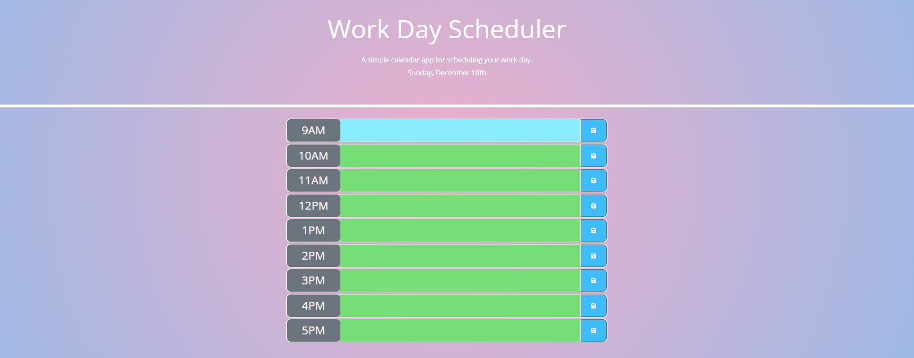

## <h1 align="center">Work Day Scheduler</h1>

## Description
The Work Day Scheduler application uses third-party API and JavaScript to create an hourly calendar-style scheduler. Users can choose a time slot and enter a task. Users can click the blue save button to the right of the task to save. The saved tasks are stored in local storage so they are still accessible even when the application is refreshed. The current date is displayed on the top of the application and the times are color coded. The current hour is depicted with the red background color, the upcoming hours are depicted in green, and the previous hours are grey. The application will auto-clear tasks at the start of every new day.

## Technologies
- HTML
- CSS
- JavaScript
- Bootstrap
- jQuery

## Table of Contents

- [Installation](#installation)
- [Usage](#usage)
- [Screenshot](#screenshot)
- [License](#license)
## User Story
AS AN employee with a busy schedule 
I WANT to add important events to a daily planner 
SO THAT I can manage my time effectively 
## Acceptance Criteria
GIVEN I am using a daily planner to create a schedule 
WHEN I open the planner 
THEN the current day is displayed at the top of the calendar 
WHEN I scroll down 
THEN I am presented with time blocks for standard business hours 
WHEN I view the time blocks for that day 
THEN each time block is color-coded to indicate whether it is in the past, present, or future
WHEN I click into a time block 
THEN I can enter an event 
WHEN I click the save button for that time block 
THEN the text for that event is saved in local storage 
WHEN I refresh the page 
THEN the saved events persist

## Installation

No installation required.
## Usage
Live link [here](https://brianlockerbie.github.io/work-day-scheduler/)

## Screenshot

## License

